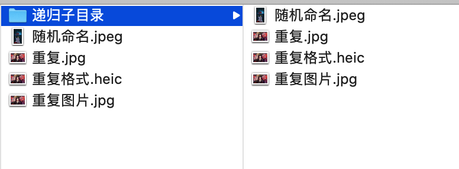
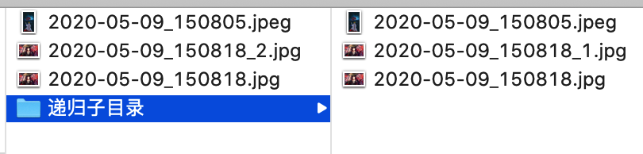

# photo_rename
照片整理神器，根据照片拍摄时间重命名照片

命名规则为 `%Y-%m-%d_%H%M%S`，如 `2020-05-09_14:58:12`；如果有重复，则会在后面添加一个数字区分，如 `2020-05-09_14:58:12_1`

## 使用方法
参数说明

```sh
usage: photo_rename.py [-h] [-b BACKUP] source

positional arguments:
  source                specify the path to be renamed

optional arguments:
  -h, --help            show this help message and exit
  -b BACKUP, --backup BACKUP
                        specify a path to copy to backup
```

举个例子

```sh
python3 photo_rename.py test -b ~/Desktop/bakcup
```

目前只处理了 Mac，Windows/Linux 系统没测试过

**注意，直接怼移动硬盘的内容进行操作有风险，请加 `-b` 进行内容备份**

## 效果预览
Before




After




## 原理说明
该脚本主要有两个方法：scandir 和 deleteDuplicate，不需要的同学可以按需删除

scandir 负责递归遍历目标文件夹，读取每个照片的创建时间，并对其重命名

deleteDuplicate 负责递归遍历目标文件夹，删除多余的重复 .heic 照片

> iPhone 导出的照片中可能会有 .png/.jpg/.jpeg 和重名的 .heic（一般照片经过编辑之后原件就会变成 .heic）

## 一些坑
### 关于如何读取照片的创建时间
尝试了多种方法，都不是很准，经常有部分照片读取不到创建日期的信息

1. 方法 1：exifread（python 插件），绝大部分读不到
2. 方法 2：stat 方法，大部分读不准
3. 方法 3：GetFileInfo 方法，小部分读不到
4. 方法 4：mdls 方法，只要 Mac 系统在预览界面能展示的“创建时间”，就可以读到，此方法目前是最佳的

### 移动硬盘的照片无法在命令行下无法被读取创建信息
必须手动拷贝到 Mac 电脑后
### 移动硬盘的照片显示被占用，文件显示为灰色，不可编辑或拷贝

```
xattr -dr com.apple.FinderInfo 移动硬盘位置/*
```

### 修改文件创建时间
```sh
touch -t 201505010000 targetFile
```

[Mac OS X 下修改文件属性：创建时间、修改时间](http://kusowhu.net/change-modified-created-date-in-macosx/)

### 加密压缩
```sh
zip -r -e myZip.zip targetFile
```

